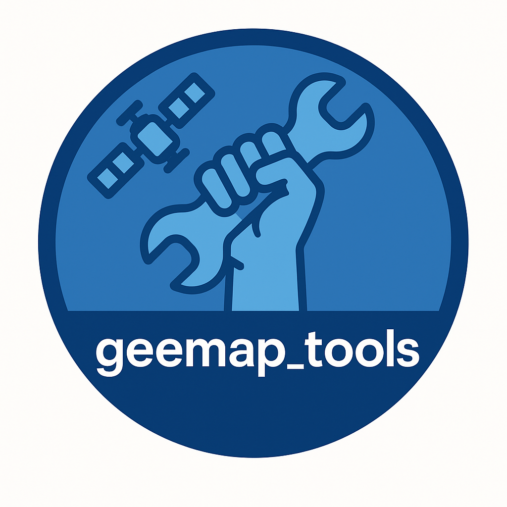

<p align="center">
  &nbsp;&nbsp;&nbsp;
  
</p>

# GEEMAP-TOOLS

*Prefere a versão em português? Acesse [README.md](./README.md).*

`geemap-tools` is a "helper" package designed to simplify the use of Google Earth Engine (GEE) and the `geemap` library. The project is maintained by the (**Oceanographic Observatory at UFF (Universidade Federal Fluminense)**)[https://observatoriooceanografico.org] and was created to streamline repetitive tasks in research, teaching, and outreach notebooks. It is tailored for researchers, students, and professionals who need practical, reusable tools for geospatial data analysis.

In addition to the general routines, `geemap-tools` also includes specific functions developed for monitoring penguin colonies and studying the “greening” of Antarctic areas. These tools are part of the **Penguin Sat** project, within the **Antarctic Observatory**, and were designed to support polar ecology research and the detection of environmental changes using remote sensing.

It is primarily built on top of the following libraries:
- [`geemap`](https://github.com/giswqs/geemap)
- [`eemont`](https://github.com/davemlz/eemont)
- [`earthengine-api`](https://developers.google.com/earth-engine/guides/python_install)

`geemap-tools` works seamlessly on both Google Colab and local environments using Jupyter Notebook or Jupyter Lab.<br>
Check the `exemplos` folder for practical demonstrations.

## Main Features

The `geemap-tools` package currently includes functions organized into submodules:

- `io.py`: Input/output for ROIs and geospatial files.
- `clouds.py`: Cloud masking and image quality filtering.
- `catalog.py`: Image search by ROI, satellite, and time range.
- `analysis.py`: Time series for vegetation indices (NDVI, EVI...), CHIRPS, TerraClimate, MapBiomas, Terrain, and more.
- `sidra_tools.py`: Programmatic access to IBGE Table 5457 (Brazilian Municipal Agricultural Production).
- **Penguin Sat**: A set of routines for detecting and monitoring penguin colonies and Antarctic vegetation (currently under development).
- `private_dev/`: Development and testing area – not included in the installed package.
- 
## Usage
> ⚠️ **Language Notice for Console Messages**  
> This package was originally developed for Brazilian students, so **the on-screen messages (warnings and debug output) are written in Portuguese**.  
>  
> However, this **does not affect international use**: all **functions, parameters, and code structure are in English**, ensuring compatibility in any Python environment.  
>  
> For detailed guidance and usage examples, please refer to the [`USAGE.md`](./USAGE.md) file, which provides bilingual explanations (Portuguese/English).

For detailed instructions, practical examples, and code snippets, please refer to the [USAGE.md](./USAGE.md) file.

All functions include bilingual docstrings (Portuguese and English) to support both international and Brazilian users.

## Quick Installation

### Local Environment (Recommended)

If you're using Anaconda or Miniconda, we recommend creating a new environment. The following are the essential packages for using Google Earth Engine. Installing `geemap-tools` as shown will automatically handle the dependencies:

```bash
conda create -n geemap-tools python=3.11
conda activate geemap-tools
mamba install -c conda-forge geemap pandas geopandas eemont xarray rioxarray matplotlib openpyxl
git clone https://github.com/andrebelem/geemap-tools.git
cd geemap-tools
pip install -e .
``` 
#### Running on COLAB?

If you're using Google Colab, simply install `geemap-tools` in your virtual environment — it already comes with all dependencies:

```
!pip install git+https://github.com/andrebelem/geemap-tools.git
```

**Note**: Some `geemap` features may not work perfectly on Colab due to environment limitations (e.g., interactive `Map.addLayer`). We recommend running locally with JupyterLab when possible. Always be cautious with very large ROIs or memory-intensive operations, as GEE may throttle or block your requests.

#### Development

This project now uses a `pyproject.toml` with support for modern `setuptools`. The `private_dev/` directory is excluded from installation. For local development with hot-reload:

```bash
pip install -e .

```

Contact<br>
Have questions, suggestions or feature requests?
Reach out: [andrebelem@id.uff.br](mailto:andrebelem@id.uff.br)
> ⚠️ This project is still under development. A citable version with a DOI will be published soon.


### Want an assistant to help you use this repo?

Check out the geemap-tools DeepWiki! [https://deepwiki.com/andrebelem/geemap-tools](https://deepwiki.com/andrebelem/geemap-tools)


