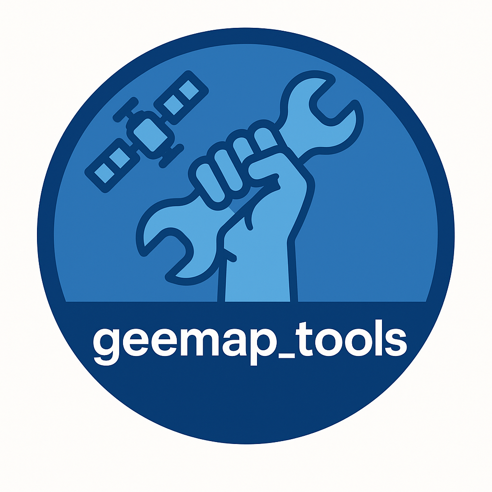

<p align="center">
  
</p>
# GEEMAP-TOOLS

*Prefer the English version? See [README-en.md](./README-en.md).*

`geemap-tools` é um pacote auxiliar desenvolvido para simplificar o uso do Google Earth Engine (GEE) e da biblioteca `geemap`.  
O projeto é mantido pelo [Observatório Oceanográfico da UFF (Universidade Federal Fluminense)](https://observatoriooceanografico.org) e foi criado para agilizar tarefas repetitivas em notebooks voltados à pesquisa, ensino e extensão.  
É voltado a pesquisadores, estudantes e profissionais que precisam de ferramentas práticas e reutilizáveis para análise de dados geoespaciais.


Ele é baseado principalmente nas bibliotecas:
- [`geemap`](https://github.com/giswqs/geemap)
- [`eemont`](https://github.com/davemlz/eemont)
- [`earthengine-api`](https://developers.google.com/earth-engine/guides/python_install)

Funciona tanto no Google Colab quanto em ambientes locais com Jupyter Notebook ou Jupyter Lab.<br>
Verifique o diretório `exemplos` para as principais funcionalidades.

## Funcionalidades principais

Atualmente o `geemap-tools` inclui funções organizadas em submódulos:

- `io.py`: Entrada e saída de ROIs e arquivos.
- `clouds.py`: Máscara de nuvens e qualidade de imagem.
- `catalog.py`: Listagem de imagens por ROI, satélite e intervalo.
- `analysis.py`: Séries temporais por índice (NDVI, EVI...), CHIRPS, TerraClimate, MapBiomas, Terrain, etc.
- `sidra_tools.py`: Acesso programático à Tabela 5457 (Produção Agrícola Municipal – IBGE).
- `private-dev/`: Área de desenvolvimento e testes – não será instalada como parte do pacote.

## Uso
> ⚠️ **Aviso sobre idioma dos avisos na tela**  
> Este pacote foi originalmente desenvolvido para estudantes brasileiros, por isso **as mensagens de aviso e debug exibidas durante a execução aparecem em português**.  
>  
> Isso **não impede seu uso internacional**: todas as **funções, parâmetros e estruturas do código estão em inglês**, garantindo compatibilidade com qualquer ambiente Python.  
>  
> Para entender o funcionamento de cada módulo e função, consulte o arquivo [`USAGE.md`](./USAGE.md), que contém explicações bilíngues (Português/Inglês).

Para instruções detalhadas, exemplos práticos e trechos de código, consulte o arquivo [USAGE.md](./USAGE.md).

Todas as funções incluem docstrings bilíngues (português e inglês) para atender tanto usuários brasileiros quanto internacionais.


## Instalação Rápida

### Ambiente Local (Recomendado)

Se estiver usando Anaconda ou Miniconda, sugerimos criar um novo ambiente para instalação. Os pacotes abaixo são os básicos essenciais para usar o Google Earth Engine. Note que ao instalar o `geemap-tools` abaixo, o sistema irá se encarregar de instalar tudo que você precisa:

```bash
conda create -n geemap-tools python=3.11
conda activate geemap-tools
mamba install -c conda-forge geemap pandas geopandas eemont xarray rioxarray matplotlib openpyxl
git clone https://github.com/andrebelem/geemap-tools.git
cd geemap-tools
pip install -e .
```
#### E no COLAB ?

Se você está no Colab, basta instalar o `geemap-tools` na sua máquina virtual do colab que ele já vem com todas as dependências.
```
!pip install git+https://github.com/andrebelem/geemap-tools.git
```
**Atenção**: Alguns recursos de geemap podem não funcionar perfeitamente no Colab devido a limitações do ambiente (ex: Map.addLayer interativo). Dê preferência ao uso local com JupyterLab. Tenha sempre cautela com ROIs muito grandes ou operações que demandam memória pois o GEE pode bloquear seus requests.

#### Desenvolvimento

Este projeto agora utiliza `pyproject.toml` com suporte a `setuptools` moderno. O diretório private_dev/ não é incluído na instalação. Para uso local com hot reload:
```bash
pip install -e .
```

**Contato**<br>
Dúvidas, sugestões de melhorias ou novas funções?
Entre em contato: [andrebelem@id.uff.br](mailto:andrebelem@id.uff.br)

### Quer um assistente para usar esse repo ?

Acesse o DeepWiki do geemap-tools ! [https://deepwiki.com/andrebelem/geemap-tools](https://deepwiki.com/andrebelem/geemap-tools)

